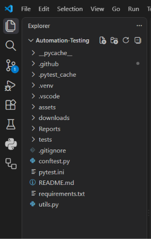
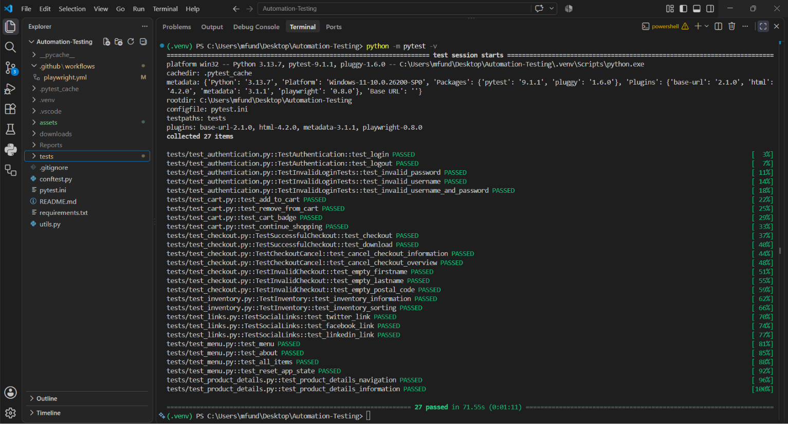
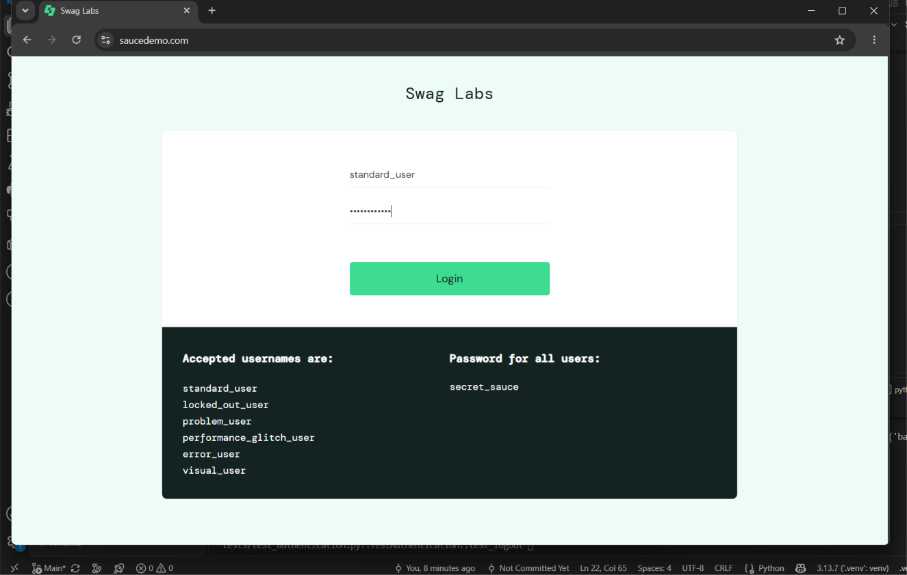
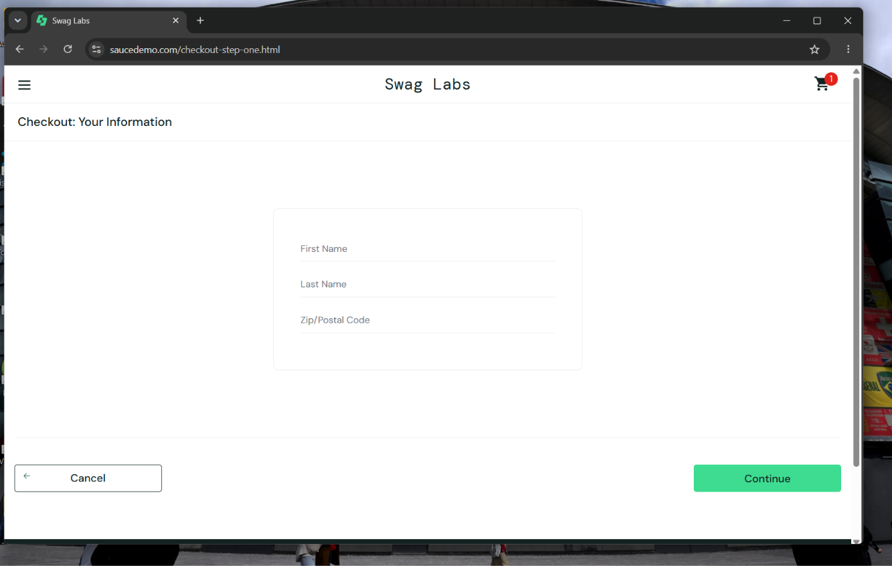
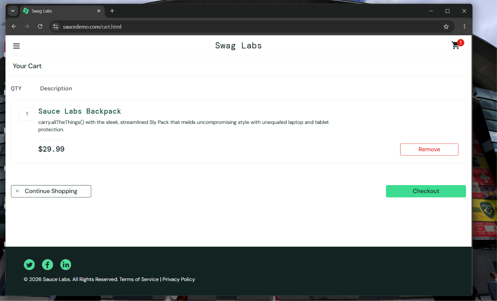
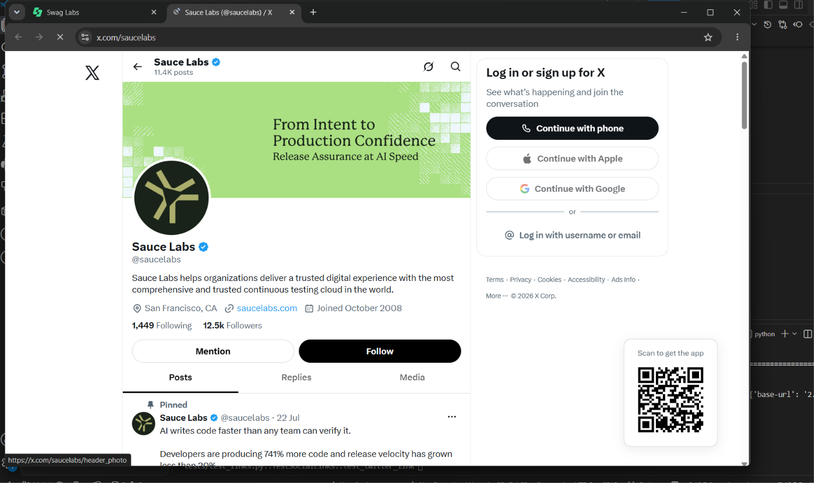
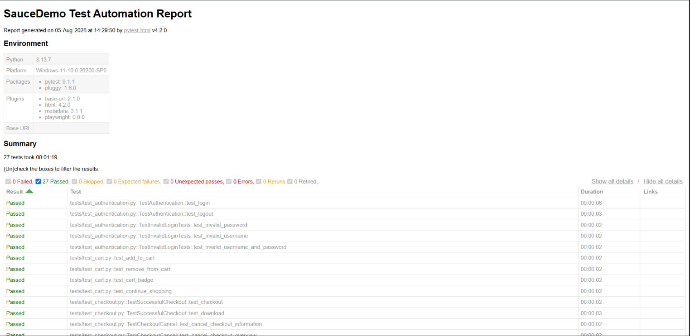
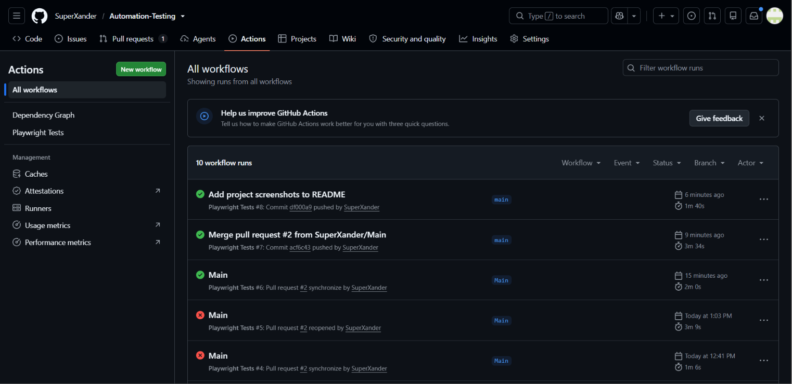

# SauceDemo Automation Testing

This project was created to learn and practice web automation testing using Playwright and Pytest.

It demonstrates an end-to-end automation testing framework built with Python, Pytest, and Playwright, featuring reusable fixtures, utilities, assertions, HTML reporting, tracing, screenshots, parallel execution, and automated testing against the SauceDemo application.

## Testing Scope

This project demonstrates the following testing types:

| Testing Type             | Coverage                                                         |
| ------------------------ | ---------------------------------------------------------------- |
| Functional Testing       | Login, Logout, Inventory, Cart, Checkout                         |
| UI Testing               | Product information, Product details, Navigation, Burger Menu    |
| End-to-End (E2E) Testing | Complete user journey from Login → Checkout → Order Confirmation |
| Smoke Testing            | Critical user flows using Pytest markers                         |
| Regression Testing       | Full automation suite executed with all tests                    |

## Technologies

* Python 3.13
* Playwright
* Pytest
* Pytest HTML
* Pytest Base URL
* Pytest Metadata
* Pytest Playwrightcls
* Git
* GitHub Actions
* uv

## Project Structure

```text
Automation-Testing/
│
├── .github/
│   └── workflows/
│       └── playwright.yml
│
├── tests/
├── assets/
├── downloads/
├── Reports/
├── conftest.py
├── utils.py
├── pytest.ini
├── .gitignore
├── .python-version
├── pyproject.toml
├── uv.lock
└── README.md
```

## Environment & Dependency Management

This project uses [uv](https://docs.astral.sh/uv/) for Python environment and dependency management.

The following files define the project environment:

* `.python-version` - Specifies the Python version used by the project.
* `pyproject.toml` - Defines project metadata and direct dependencies.
* `uv.lock` - Locks the resolved dependency versions for reproducible environments.

Install and synchronize the project environment with:

```terminal
uv sync
```

Run commands through the project's managed environment using `uv run`.

## Features Tested
- Login Automation
- Cart Automation
- Checkout Automation
- Inventory Validation
- Product Details Validation
- Burger Menu Validation

### Authentication

* Login
* Invalid Login
* Logout

### Inventory

* Product information
* Product details
* Sorting
* Cart badge

### Cart

* Add to cart
* Remove from cart

### Checkout

* Successful checkout
* Invalid checkout
* Checkout navigation
* PDF order download

### Menu & Navigation

* Burger menu
* About
* All Items
* Reset App State

### External Links

* Twitter
* Facebook
* LinkedIn

## Installation

``terminal
git clone ...
cd Automation-Testing
pip install -r requirements.txt
playwright install

## CI/CD

This project uses GitHub Actions to automatically execute the test suite whenever code is pushed to the repository.

## Screenshots

### Project Structure



### Test Execution



### Browser Automation






### HTML Report



### GitHub Actions



## Reports
After execution, HTML reports and Playwright traces are generated for debugging.

### Generate an HTML Report

```terminal
uv run pytest --html=Reports/HTML/report.html --self-contained-html
```

### View Playwright Trace

```terminal
uv run playwright show-trace Reports/Traces/trace.zip
```

### Run All Tests

```terminal
uv run pytest
```

### Run Smoke Tests

```terminal
uv run pytest -m smoke
```

### Run Checkout Tests

```terminal
uv run pytest -m checkout
```

### Run Tests in Parallel

```terminal
uv run pytest -n auto
```

## Conclusion

This project was developed as a hands-on learning exercise to gain practical experience with Playwright, Pytest, Git, GitHub, and GitHub Actions.

It demonstrates the fundamentals of building and maintaining an automated UI testing project, including reusable test utilities, reporting, failure diagnostics, and continuous integration.
